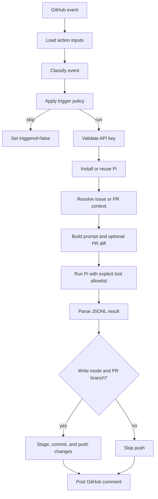

# Design and architecture

[中文](../zh/design.md)

This document explains why pi-action is structured the way it is, how an event becomes a Pi run, and which responsibilities belong to the workflow, the action, and Pi itself.

## Design goals

pi-action is intentionally a small orchestration layer around the Pi CLI. Its main goals are:

- make an explicit comment the default way to spend model tokens;
- keep the default tool set read-only;
- support both built-in providers and compatible custom endpoints;
- turn Pi's JSONL event stream into a useful GitHub comment;
- allow controlled edits on pull request branches without giving Pi the GitHub token;
- keep event parsing and policy decisions testable as pure functions.

It is not intended to be a container sandbox, a general workflow engine, or a replacement for GitHub branch protection.

## Execution flow

Trigger evaluation happens before installation and provider setup. A workflow may run for every issue comment, but an unrelated or unauthorized comment exits without downloading Pi or requiring a provider key.

## Trigger model

There are two independent trigger paths.

| Path | Required conditions | Task text |
|---|---|---|
| Comment trigger | `issue_comment.created`, trigger phrase present, actor is not a bot, and commenter is trusted | Text after the first trigger phrase |
| Direct trigger | Supported `pull_request` or `issues` action and a non-empty `direct_prompt` | The configured `direct_prompt` |

For comment triggers, trusted means GitHub reports `OWNER`, `MEMBER`, or `COLLABORATOR`, or the login appears in `allowed_users`. The allow-list is additive; it does not remove access from repository collaborators.

Supported direct actions are `opened`, `reopened`, `synchronize`, and `ready_for_review` for pull requests, and `opened` or `reopened` for issues.

Direct triggers are not association-gated. If `direct_prompt` is enabled on a public `issues` workflow, any newly opened issue can cause a run. Use workflow-level `if:` expressions when a direct trigger needs a stricter policy.

## Module boundaries

| Module | Responsibility |
|---|---|
| `src/index.ts` | Minimal GitHub Action entrypoint and final error boundary |
| `src/action.ts` | End-to-end orchestration and dependency boundary used by tests |
| `src/events.ts` | Defensive conversion of webhook payloads into typed events |
| `src/decisions.ts` | Trigger, actor, and event-action policy |
| `src/config.ts` | Input parsing, validation, and tool policy |
| `src/prompt.ts` | Prompt assembly and input truncation |
| `src/pi-runner.ts` | Pi arguments, child-process environment, timeout, and JSONL parsing |
| `src/github.ts` | Comment formatting and Git commit/push operations |
| `src/install.ts` | Reuse or global installation of the Pi CLI |
| `src/models-config.ts` | Custom-provider `models.json` generation |

The orchestration function accepts dependency overrides so tests can exercise full issue and PR flows without GitHub or provider network calls.

## Prompt construction

The prompt contains:

1. the requested task;
2. repository and issue/PR metadata;
3. the issue or PR body, capped at 20,000 characters;
4. the PR diff, capped at 60,000 characters;
5. the active read/write constraints;
6. the triggering user.

The limits keep large webhook content from dominating the model context. The checked-out repository remains available to Pi, so the diff is context rather than the only source of code.

Issue bodies, PR bodies, diffs, and comments are untrusted model input. Tool restrictions and workflow permissions must enforce safety; prompt wording alone is not a security boundary.

## Provider setup

Built-in providers receive the selected provider, model, and API key through Pi's CLI arguments. When `base_url` is configured, pi-action registers a `custom` provider in `~/.pi/agent/models.json` and references the key through `PI_API_KEY`.

`pi_version` defaults to `latest`. This is convenient but not reproducible. Production workflows should pin a tested version or semver range. On self-hosted runners, an existing `pi` executable is reused and the requested version is not reinstalled.

## Result and failure semantics

Pi runs in print mode with JSONL output. The action records:

- the final assistant text;
- completed tool-call count;
- files reported by `edit` and `write` tool events;
- tool or retry errors;
- the process exit code and timeout state.

The assistant text becomes an issue or PR comment. The `response` output is capped at 60,000 characters. A failed Pi run is commented first and then marks the Action step as failed, preserving diagnostic output in the conversation.

## Write path

Write mode enables Pi's editing and shell tools. After Pi exits, the action checks the working tree with Git, stages all changes, creates one commit, and pushes `HEAD` to the PR head branch.

Important consequences:

- the workflow must check out the correct PR head before running Pi;
- the checkout should start clean because all changes are staged;
- issue-only runs have no PR branch and therefore do not auto-push;
- automatic push currently targets the repository from the event context, so fork PRs are not a supported write target;
- branch protection and token permissions still apply.

See [Tools and security](tools-and-security.md) for the permission model and [Workflow examples](examples.md) for correct checkout configurations.

## Testing strategy

The test suite combines pure unit tests with boundary-level integration tests:

- webhook and trigger-policy tables;
- configuration and tool allowlists;
- prompt truncation and JSONL parsing;
- real child processes using a temporary fake `pi` executable;
- real commits and pushes using temporary local Git repositories;
- full action orchestration with injected GitHub and Pi dependencies.

`npm run test:coverage` enforces minimum coverage of 95% lines, 80% branches, and 90% functions for the testable source modules.
