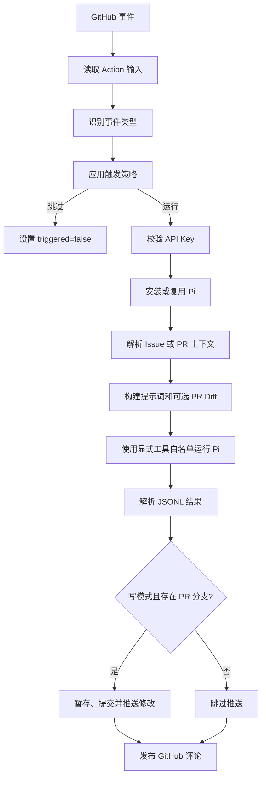

# 设计与架构

[English](../en/design.md)

本文解释 pi-action 为什么采用当前结构、一个 GitHub 事件如何转化为一次 Pi 运行，以及工作流、Action 和 Pi 各自承担哪些职责。

## 设计目标

pi-action 有意保持为 Pi CLI 之上的轻量编排层，主要目标包括：

- 默认通过显式评论触发，避免无意消耗模型额度；
- 默认工具集保持只读；
- 同时支持内置模型提供商和兼容的自定义端点；
- 将 Pi 的 JSONL 事件流转化为有用的 GitHub 评论；
- 在不向 Pi 暴露 GitHub Token 的情况下，对 Pull Request 分支进行受控修改；
- 让事件解析和策略判断尽可能保持为可测试的纯函数。

它不是容器沙箱、通用工作流引擎，也不能替代 GitHub 分支保护规则。

## 执行流程

触发判断发生在安装 Pi 和配置模型提供商之前。即使工作流监听了所有 Issue 评论，无关或未授权的评论也会直接退出，不会下载 Pi，也不要求提供模型 API Key。

## 触发模型

系统包含两条彼此独立的触发路径。

| 路径 | 必要条件 | 任务内容 |
|---|---|---|
| 评论触发 | `issue_comment.created`、评论包含触发词、操作者不是机器人且评论者可信 | 第一个触发词之后的文本 |
| 直接触发 | 支持的 `pull_request` 或 `issues` 动作，并配置了非空 `direct_prompt` | 配置的 `direct_prompt` |

对于评论触发，“可信”表示 GitHub 返回的关联身份是 `OWNER`、`MEMBER` 或 `COLLABORATOR`，或者用户名出现在 `allowed_users` 中。该名单是增量授权，不会取消仓库协作者原有的触发权限。

Pull Request 支持的直接动作是 `opened`、`reopened`、`synchronize` 和 `ready_for_review`；Issue 支持 `opened` 和 `reopened`。

直接触发不会检查作者关联身份。如果公开仓库在 `issues` 工作流中配置了 `direct_prompt`，任何新建 Issue 都可能触发一次运行。需要更严格策略时，应使用工作流级别的 `if:` 表达式。

## 模块边界

| 模块 | 职责 |
|---|---|
| `src/index.ts` | 最小化的 GitHub Action 入口和最终错误边界 |
| `src/action.ts` | 端到端编排，以及供测试注入依赖的边界 |
| `src/events.ts` | 将 Webhook Payload 防御性地转换为类型化事件 |
| `src/decisions.ts` | 触发条件、操作者和事件动作策略 |
| `src/config.ts` | 输入解析、校验和工具策略 |
| `src/prompt.ts` | 提示词构建和输入截断 |
| `src/pi-runner.ts` | Pi 参数、子进程环境、超时和 JSONL 解析 |
| `src/github.ts` | 评论格式化以及 Git 提交和推送 |
| `src/install.ts` | 复用或全局安装 Pi CLI |
| `src/models-config.ts` | 生成自定义模型提供商的 `models.json` |

编排函数允许覆盖依赖，因此测试可以在不访问 GitHub 或模型网络接口的情况下覆盖完整的 Issue 和 PR 流程。

## 提示词构建

提示词包含：

1. 请求执行的任务；
2. 仓库以及 Issue/PR 元数据；
3. 最多 20,000 字符的 Issue 或 PR 正文；
4. 最多 60,000 字符的 PR Diff；
5. 当前生效的读写限制；
6. 触发用户。

这些限制避免大型 Webhook 内容占据过多模型上下文。Pi 仍然可以访问工作流检出的仓库，因此 Diff 只是辅助上下文，并不是唯一的代码来源。

Issue 正文、PR 正文、Diff 和评论都是不可信的模型输入。安全性必须由工具限制和工作流权限来强制保证，提示词中的约束文字本身不是安全边界。

## 模型提供商配置

对于内置提供商，pi-action 通过 Pi CLI 参数传递提供商、模型和 API Key。配置 `base_url` 时，pi-action 会在 `~/.pi/agent/models.json` 中注册 `custom` 提供商，并通过 `PI_API_KEY` 引用密钥。

`pi_version` 默认是 `latest`，使用方便但不可复现。生产工作流应固定经过验证的版本或 SemVer 范围。在自托管 Runner 上，如果已经存在 `pi` 可执行文件，Action 会直接复用，不会按照请求版本重新安装。

## 结果和失败语义

Pi 以打印模式运行并输出 JSONL。Action 会记录：

- 最终助手文本；
- 已完成的工具调用数量；
- `edit` 和 `write` 工具事件报告的文件；
- 工具错误或自动重试错误；
- 进程退出码和超时状态。

助手文本会成为 Issue 或 PR 评论。`response` 输出最多保留 60,000 个字符。如果 Pi 运行失败，Action 会先发布带诊断信息的评论，再将 Action 步骤标记为失败。

## 写回流程

写模式会启用 Pi 的编辑和 Shell 工具。Pi 退出后，Action 使用 Git 检查工作区、暂存全部修改、创建一个提交，并将 `HEAD` 推送到 PR 的 Head 分支。

这会带来以下约束：

- 工作流必须在运行 Pi 前检出正确的 PR Head；
- 因为所有修改都会被暂存，所以检出后的工作区应保持干净；
- 纯 Issue 运行不存在 PR 分支，因此不会自动推送；
- 自动推送目前以事件上下文中的仓库为目标，不支持向 Fork PR 写回；
- 分支保护和 Token 权限仍然有效。

权限模型请参阅[工具、权限与安全](tools-and-security.md)，正确的检出配置请参阅[工作流示例](examples.md)。

## 测试策略

测试套件结合了纯单元测试和边界级集成测试：

- Webhook 和触发策略表；
- 配置解析与工具白名单；
- 提示词截断与 JSONL 解析；
- 使用临时伪 `pi` 可执行文件运行真实子进程；
- 使用临时本地 Git 仓库执行真实提交和推送；
- 通过注入 GitHub 和 Pi 依赖测试完整 Action 编排。

`npm run test:coverage` 对可测试源码强制要求至少 95% 行覆盖率、80% 分支覆盖率和 90% 函数覆盖率。
